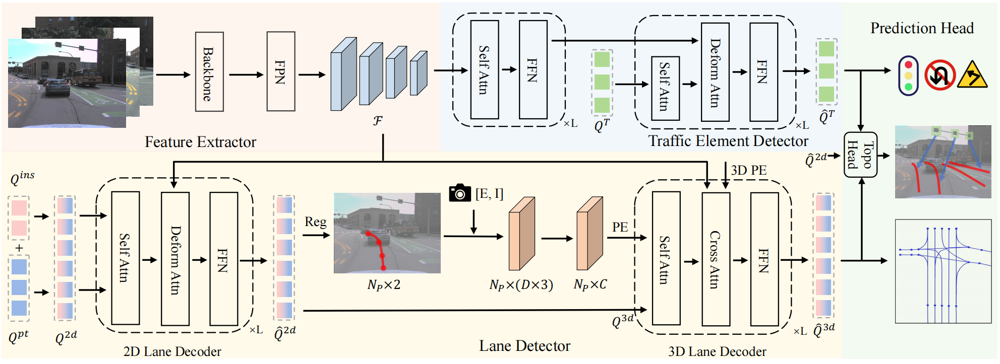

# Topo2D

This repo is the official PyTorch implementation for paper:
[Enhancing 3D Lane Detection and Topology Reasoning with 2D Lane Priors](https://arxiv.org/abs/2406.03105).



Our framework, named Topo2D, enhances both lane detection and topology reasoning capabilities by integrating 2D lane priors. The 2D and 3D lane detectors are with similar transformer-based architectures. For 3D lane detection, we use the 2D lane query features and 2D coordinates obtained by the 2D lane decoder to initialize the 3D lane queries and positional embeddings. For topology prediction, we utilize a comprehensive approach that not only involves the features from 3D lanes and traffic elements, but also integrates corresponding 2D lane features, thereby enhancing overall performance. We validate our Topo2D on the multi-view topology reasoning benchmark OpenLane-V2 and the single-view 3D lane detection benchmark OpenLane. Topo2D achieves state-of-the-art performance on both benchmarks.

## News
<!-- - [2024/06/05] The code and models are released. -->
- [2024/06/05] The paper is released on arXiv.

## Main Results

### Results on OpenLane-V2 *subset_A*.

|    Method     | Backbone  | Epoch |   OLS    | DET<sub>l</sub> | DET<sub>t</sub> | TOP<sub>ll</sub> | TOP<sub>lt</sub> |
| :-----------: | :-------: | :---: | :------: | :-------------: | :-------------: | :--------------: | :--------------: |
|     STSU      | ResNet-50 |  24   |   29.3   |      12.7       |      43.0       |       2.9        |       19.8       |
| VectorMapNet  | ResNet-50 |  24   |   24.9   |      11.1       |      41.7       |       2.7        |       9.2        |
|     MapTR     | ResNet-50 |  24   |   24.2   |       8.3       |      43.5       |       2.3        |       8.9        |
|    TopoNet    | ResNet-50 |  24   |   39.8   |      28.6       |      48.6       |       10.9       |       23.8       |
| Topo2D (Ours) | ResNet-50 |  24   | **44.5** |    **29.1**     |    **50.6**     |     **22.3**     |     **26.2**     |

### Results on OpenLane validation set.

|    Method     |   All    | Up &<br>Down |   Curve   | Extreme<br>Weather |   Night   | Intersection | Merge<br>& Split |
| :-----------: | :------: | :----------: | :-------: | :----------------: | :-------: | :----------: | :--------------: |
|  3D-LaneNet   |   44.1   |     40.8     |   46.5    |        47.5        |   41.5    |     32.1     |       41.7       |
|  Gen-LaneNet  |   32.3   |     25.4     |   33.5    |        28.1        |   18.7    |     21.4     |       31.0       |
|  PersFormer   |   50.5   |     42.4     |   55.6    |        48.6        |   46.6    |     40.0     |       50.7       | 
|  CurveFormer  |   50.5   |     45.2     |   56.6    |        49.7        |   49.1    |     42.9     |       45.4       | 
| Anchor3DLane  |   53.7   |     46.7     |   57.2    |        52.5        |   47.8    |     45.4     |       51.2       |
|  BEVLaneDet   |   58.4   |     48.7     |   63.1    |        53.4        |   53.4    |     50.3     |       53.7       |
|     LATR      |   61.9   |     55.2     | **68.2**  |        57.1        |   55.4    |     52.3     |       61.5       |
| Topo2D (Ours) | **62.6** |   **55.5**   |   67.7    |      **59.1**      | **57.4**  |   **52.4**   |     **62.5**     |

## Citation
If you find this repo useful for your research, please consider citing it using the following BibTeX entry.

```
@misc{li2024enhancing,
      title={Enhancing 3D Lane Detection and Topology Reasoning with 2D Lane Priors}, 
      author={Han Li and Zehao Huang and Zitian Wang and Wenge Rong and Naiyan Wang and Si Liu},
      year={2024},
      eprint={2406.03105},
      archivePrefix={arXiv},
      primaryClass={cs.CV}
}
```

## Acknowledgement
We thank the authors that open the following projects.
- [MMDetection3D](https://github.com/open-mmlab/mmdetection3d)
- [MapTR](https://github.com/hustvl/MapTR)
- [PETR](https://github.com/megvii-research/PETR)
- [OpenLane-v2](https://github.com/OpenDriveLab/OpenLane-V2)
- [TopoNet](https://github.com/OpenDriveLab/TopoNet)
